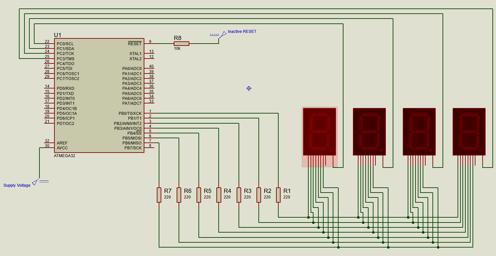

# MM:SS Digital Clock using ATmega32

A digital clock displaying **Minutes and Seconds (MM:SS)** using **4 multiplexed 7-segment displays** and **AVR ATmega32** microcontroller.

The project uses **Timer1 in CTC mode** to generate a precise 1-second interrupt and is simulated using **Proteus**.

---

## 🧰 Tools Used

- **Microchip Studio**
- **Proteus 8 Professional**
- **AVR ATmega16 / ATmega32**
- **AVR-GCC**

---

## 🔧 Hardware Requirements

| Component | Quantity |
|---------|---------|
| ATmega16 / ATmega32 | 1 |
| 7-Segment Display (Common Cathode) | 4 |
| 220Ω Resistors (segment current limiting) | 7 |
| 10kΩ Resistors (RESET current limiting) | 1 |
| Power Supply | 5V |
| *(Optional)* Reset Button | 1 |

> Internal RC oscillator is used (no external crystal required).

---

## 🔌 Pin Connections

### Segment Connections (Common for all displays)
| Segment | ATmega Pin |
|-------|------------|
| a–g | PB0–PB6 (via 220Ω resistors) |

### Digit Enable Pins (Active LOW)
| Digit | Function | ATmega Pin |
|------|---------|------------|
| D1 | Minutes Tens | PC0 |
| D2 | Minutes Units | PC1 |
| D3 | Seconds Tens | PC2 |
| D4 | Seconds Units | PC3 |

### Proteus Schematic Diagram



---

## ⏱️ How It Works

- **Timer1** is configured in **CTC mode**
- Generates an interrupt every **1 second**
- ISR updates `seconds` and `minutes`
- Display uses **multiplexing**
- Each digit is enabled one at a time at high speed

---

## ▶️ How to Run the Project

### Step 1: Clone the Repository
```bash
git clone https://github.com/<your-username>/mm-ss-avr-clock.git
````

### Step 2: Open in Microchip Studio

1. Open **Microchip Studio**
2. Click **File → Open → Project/Solution**
3. Select the `.atsln` file

### Step 3: Build the Project

* Press **F7** or click **Build → Build Solution**
* This generates the `.hex` file

### Step 4: Open Proteus

1. Open the `.pdsprj` file
2. Double-click the ATmega32
3. Load the generated `.hex` file
4. Set the clock frequency to `1MHz`.
5. Click **Run**

🎉 The MM:SS clock should start running!

---

## 📁 Project Structure

```
avr-basic-clock/
│
├── clock-program/
│    ├── clock-program/
│    │   ├── main.c
│    │   ├── clock-program.cproj
│    ├── clock-program.atsln
│   
├── proteus/
│   └── clock_simulation.pdsprj
│
├── README.md
├── .gitignore
└── LICENSE
```

---

## 📜 License

This project is open-source and available under the [MIT License](LICENSE).

---

## 👤 Author

**Kushal Prasad Joshi**

Embedded Systems / AVR Project

